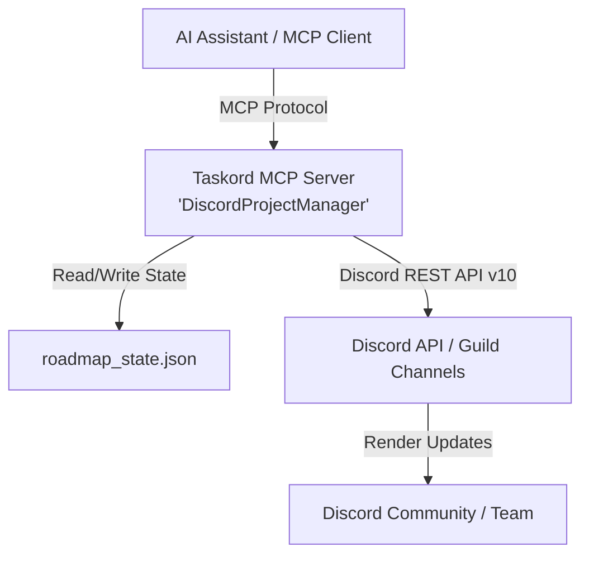

# Taskord (Discord Project Manager MCP Server)

Taskord is a **Model Context Protocol (MCP)** server (`DiscordProjectManager`) built with Python and FastMCP. It enables AI coding assistants and LLMs to manage project planning, brainstormed ideas, roadmap lifecycles, and live task progress tracking seamlessly inside Discord servers.

---

## 📋 Table of Contents
- [Overview](#overview)
- [Architecture & Tech Stack](#architecture--tech-stack)
- [Configuration & Environment Variables](#configuration--environment-variables)
- [Core Features & MCP Tools](#core-features--mcp-tools)
  - [`save_idea`](#1-save_idea)
  - [`create_roadmap`](#2-create_roadmap)
  - [`replace_roadmap`](#3-replace_roadmap)
  - [`update_roadmap_task`](#4-update_roadmap_task)
- [Progress Calculation & Discord Formatting](#progress-calculation--discord-formatting)
- [State Management (`roadmap_state.json`)](#state-management-roadmap_statejson)
- [Installation & Setup](#installation--setup)
- [Usage with MCP Clients](#usage-with-mcp-clients)

---

## Overview

Taskord turns Discord into an interactive project management dashboard. Instead of flooding channels with new messages for every update, Taskord tracks specific Discord message IDs and performs in-place updates (`PATCH`) on roadmaps, complete with automatic recalculation of visual ASCII progress bars.

---

## Architecture & Tech Stack

- **Server Framework:** [FastMCP (`mcp.server.fastmcp`)](https://github.com/modelcontextprotocol/python-sdk)
- **Language:** Python 3.10+
- **HTTP Client:** `httpx` (Synchronous HTTP calls)
- **API Target:** Discord REST API v10 (`https://discord.com/api/v10`)
- **Persistence:** Local JSON file (`roadmap_state.json`)



---

## Configuration & Environment Variables

| Variable / Constant | Type | Source / Default | Description |
| :--- | :--- | :--- | :--- |
| `DISCORD_BOT_TOKEN` | Environment Variable | `os.environ.get("DISCORD_BOT_TOKEN")` | Bot authorization token for Discord API authentication. |
| `GUILD_ID` | Hardcoded Constant | `"1543979060823330946"` | Discord server / guild ID where project channels reside. |
| `BASE_URL` | Constant | `"https://discord.com/api/v10"` | Discord v10 REST endpoint base URL. |
| `STATE_FILE` | Constant | `"roadmap_state.json"` | Path to the local JSON file tracking active roadmap messages. |

---

## Core Features & MCP Tools

### 1. `save_idea`
Saves a brainstormed concept or task idea into the designated Discord project ideas/to-do channel.

- **Parameters:**
  - `project_name` (`str`): Name of the project / Discord category.
  - `idea_text` (`str`): Description/text of the brainstormed idea.
- **Channel Resolution Strategy:**
  1. Searches for channel `#to-do` under the category named `project_name`.
  2. Fallback: Searches for channel `#{project_name}-ideas`.
- **Discord Output Format:**
  ```markdown
  💡 **New Idea:**
  <idea_text>
  ```

---

### 2. `create_roadmap`
Posts a new formatted roadmap message to Discord and records its channel and message IDs for tracking.

- **Parameters:**
  - `project_name` (`str`): Name of the project.
  - `initial_roadmap` (`str`): Markdown-formatted roadmap text.
- **Channel Resolution Strategy:**
  1. Channel `#roadmap` under category `project_name`.
  2. Channel `#{project_name}` under category `Roadmaps`.
  3. Channel `#{project_name}-roadmap`.
- **State Action:** Saves `{ "channel_id": channel_id, "message_id": message_id }` into `roadmap_state.json` under key `project_name.lower()`.

---

### 3. `replace_roadmap`
Completely updates/replaces the contents of the existing tracked roadmap message using an in-place Discord API `PATCH` request.

- **Parameters:**
  - `project_name` (`str`): Name of the project.
  - `roadmap` (`str`): Replacement markdown content.
- **Behavior:** Ensures the roadmap remains a single canonical message without cluttering the channel with new messages.

---

### 4. `update_roadmap_task`
Updates the status icon of a single task in the roadmap message and automatically recalculates category progress percentages and progress bars.

- **Parameters:**
  - `project_name` (`str`): Name of the project.
  - `task_name` (`str`): Substring matching the task line in the roadmap.
  - `status` (`str`): One of the supported status keys:
    - `"done"` → `✅`
    - `"progress"` → `🔄`
    - `"testing"` → `⚠️`
    - `"planned"` → `⬜`
- **Workflow:**
  1. Fetches current message content via `GET /channels/{channel_id}/messages/{message_id}`.
  2. Locates the line containing `task_name` and replaces its status icon.
  3. Groups tasks by category headers and counts completed (`✅`) vs. total tasks.
  4. Generates a 10-block visual progress bar (`█` and `░`) with percentage completion for each category.
  5. Appends the standard Legend and patches the message in-place on Discord.

---

## Progress Calculation & Discord Formatting

### Status Icons
| Status Key | Emoji | Meaning | Counts Toward Progress |
| :--- | :---: | :--- | :---: |
| `done` | `✅` | Completed | **Yes** (100% per task) |
| `progress` | `🔄` | In Progress | No |
| `testing` | `⚠️` | In Testing | No |
| `planned` | `⬜` | Planned | No |

### Visual Progress Bar Format
The progress bar uses a 10-block Unicode representation:
$$\text{pct} = \left\lfloor \frac{\text{completed}}{\text{total}} \times 100 \right\rfloor$$
$$\text{filled blocks} = \lfloor \text{pct} / 10 \rfloor, \quad \text{empty blocks} = 10 - \text{filled blocks}$$

**Example Discord Output:**
```markdown
🗺️ **Project Roadmap**

Backend Development
✅ Setup FastMCP server
🔄 Implement Discord REST API client
⬜ Add SQLite database backend

Frontend Dashboard
✅ Setup React UI
⬜ Connect WebSockets

---
 **Overall Progress**
Backend Development: ██████░░░░ 66%
Frontend Dashboard: █████░░░░░ 50%

---
**Legend**
✅ Completed
🔄 In Progress
⚠️ In Testing
⬜ Planned
```

---

## State Management (`roadmap_state.json`)

The server tracks active roadmap messages locally in `roadmap_state.json`.

### Schema
```json
{
  "<project_key>": {
    "channel_id": "<discord_channel_id>",
    "message_id": "<discord_message_id>"
  }
}
```

### Current Tracked Projects
| Project Key | Channel ID | Message ID |
| :--- | :--- | :--- |
| `fut17-revival` | `1544006434688081961` | `1544279621468692530` |
| `centsible` | `1544006194484617317` | `1544324964172173383` |
| `lsarcade` | `1544362172430159962` | `1544374155317739612` |

---

## Installation & Setup

### Prerequisites
- Python 3.10+
- Discord Bot Token with permissions to view channels and send/edit messages in the specified Guild.

### Dependencies
Install the required packages:
```bash
pip install mcp httpx
```

### Environment Configuration
Set your Discord Bot token:
```bash
# Windows PowerShell
$env:DISCORD_BOT_TOKEN="your_bot_token_here"

# Linux / macOS
export DISCORD_BOT_TOKEN="your_bot_token_here"
```

### Running the Server
```bash
python server.py
```

---

## Usage with MCP Clients

Add the server to your MCP configuration (e.g., Claude Desktop, Cursor, Antigravity, or Cline):

```json
{
  "mcpServers": {
    "taskord": {
      "command": "python",
      "args": ["C:/Projects/Taskord/server.py"],
      "env": {
        "DISCORD_BOT_TOKEN": "your_bot_token_here"
      }
    }
  }
}
```

---

## 💡 Planned Improvements & Registered Suggestions

The following feature requests have been registered in the `#suggestions` channel (Taskord category) on Discord:

1. **Pull Request Activity Logging:**
   - Record and log GitHub/Git pull requests (opened, merged, closed) into dedicated project channels (e.g., `#git`).
   - Keep project members informed with PR titles, authors, status, and summaries.

2. **Automated Project & Channel Scaffolding:**
   - Create a project on demand directly through MCP tools.
   - Automatically provisions a Discord Category (matching the project name) and spawns 3 standard channels:
     - `#roadmap`
     - `#to-do`
     - `#git`

3. **Intelligent Work Analysis & Multi-Channel Sync:**
   - Automated sync engine that analyzes recent codebase work, commits, and progress.
   - Crawls and synchronizes all text channels under a project to align tasks, roadmaps, and git logs with actual development status.

